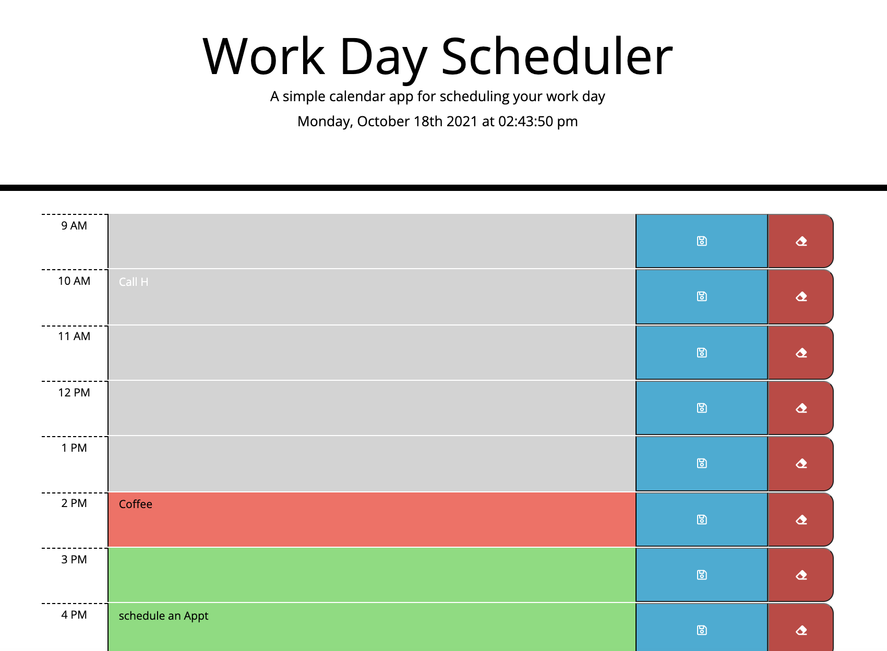

# day-planner

# About
This is a calendar application that allows a user to save events for each hour of the day. It helps people who has a busy schedule and want to manage their time effectively. This calender is designed for standard working hours from 9am to 5pm. It is color coded. It shows the past, present and future events in different colors.

# Screenshot of the deployed application

# Link

[Link to the Deployed Application](https://hekmatsalehi.github.io/day-planner/)